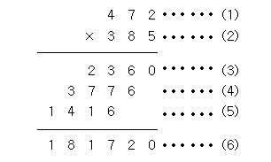

# Hello World

System.out.print() 에 대해 알 수 있다.

## 문제

Hello World!를 출력하시오.

## 입력

없음

## 출력

Hello World!를 출력하시오.

## 제출

```java
public class Main {
    public static void main(String[] args){
        System.out.print("Hello World!");
    }
}
```

# A + B

## 문제

두 정수 A와 B를 입력받은 다음, A+B를 출력하는 프로그램을 작성하시오.

## 입력

첫째 줄에 A와 B가 주어진다. (0 < A, B < 10)

```java
1 2
```

## 출력

첫째 줄에 A+B를 출력한다.

## 제출

```java
import java.io.BufferedReader;
import java.io.InputStreamReader;
import java.io.IOException;
import java.util.StringTokenizer;

public class Main {
    public static void main(String[] args) throws IOException {
        // BufferedReader 객체 생성
        BufferedReader br = new BufferedReader(new InputStreamReader(System.in));

        // 한 행을 읽어들이고 공백을 기준으로 분리
        StringTokenizer st = new StringTokenizer(br.readLine(), " ");
        int a = Integer.parseInt(st.nextToken());
        int b = Integer.parseInt(st.nextToken());

        // 두 정수의 합을 출력
        System.out.print(a + b);
    }
}
```

# A - B

## 문제

두 정수 A와 B를 입력받은 다음, A-B를 출력하는 프로그램을 작성하시오.

## 입력

첫째 줄에 A와 B가 주어진다. (0 < A, B < 10)

```java
3 2
```

## 출력

첫째 줄에 A-B를 출력한다.

## 제출

```java
import java.io.BufferedReader;
import java.io.InputStreamReader;
import java.io.IOException;
import java.util.StringTokenizer;

public class Main {
    public static void main(String[] args) throws IOException {
        BufferedReader br = new BufferedReader(new InputStreamReader(System.in));
  
        StringTokenizer st = new StringTokenizer(br.readLine()," ");
        int a = Integer.parseInt(st.nextToken());
        int b = Integer.parseInt(st.nextToken());
  
        System.out.print(a-b);
    }
}
```

# A X B

## 문제

두 정수 A와 B를 입력받은 다음, A×B를 출력하는 프로그램을 작성하시오.

## 입력

첫째 줄에 A와 B가 주어진다. (0 < A, B < 10)

```java
1 2
3 4
```

## 출력

첫째 줄에 A×B를 출력한다.

```java
2
12
```

## 제출

```java
import java.io.BufferedReader;
import java.io.InputStreamReader;
import java.io.IOException;
import java.util.StringTokenizer;
public class Main {
  public static void main(String[] args) throws IOException {
    BufferedReader br = new BufferedReader(new InputStreamReader(System.in));

    StringTokenizer st = new StringTokenizer(br.readLine()," ");
    int a = Integer.parseInt(st.nextToken());
    int b = Integer.parseInt(st.nextToken());

    System.out.print(a*b);
  }
}
```

# A / B

## 문제

두 정수 A와 B를 입력받은 다음, A/B를 출력하는 프로그램을 작성하시오.

## 입력

첫째 줄에 A와 B가 주어진다. (0 < A, B < 10)

```java
1 3
4 5
```

## 출력

첫째 줄에 A/B를 출력한다. 실제 정답과 출력값의 절대오차 또는 상대오차가 10-9 이하이면 정답이다.

```java
0.33333333333333333333333333333333
0.8
```

## 제출

```java
import java.io.BufferedReader;
import java.io.InputStreamReader;
import java.io.IOException;
import java.util.StringTokenizer;
import java.text.NumberFormat;

public class Main {
    public static void main(String[] args) throws IOException{
        BufferedReader br = new BufferedReader(new InputStreamReader(System.in));
  
        String str = br.readLine(); 
        StringTokenizer st = new StringTokenizer(str, " ");
        int a = Integer.parseInt(st.nextToken());//a는 순수 숫자가아닌 알파벳과 함께 표기됨
        int b = Integer.parseInt(st.nextToken());
  
        // int형을 double형으로 변환하여 나눗셈 수행
        double result = (double) a / b;

        // 소숫점 이하 9자리까지 출력
        System.out.printf("%.9f", result);
    }
}
```

# 사칙연산

## 문제

두 자연수 A와 B가 주어진다. 이때, A+B, A-B, A*B, A/B(몫), A%B(나머지)를 출력하는 프로그램을 작성하시오.

## 입력

두 자연수 A와 B가 주어진다. (1 ≤ A, B ≤ 10,000)

```java
7 3
```

## 출력

첫째 줄에 A+B, 둘째 줄에 A-B, 셋째 줄에 A*B, 넷째 줄에 A/B, 다섯째 줄에 A%B를 출력한다.

```java
10
4
21
2
1
```

## 제출

```java
import java.io.BufferedReader;
import java.io.InputStreamReader;
import java.io.IOException;
import java.util.StringTokenizer;

public class Main {
    public static void main(String[] args) throws IOException {
        BufferedReader br = new BufferedReader(new InputStreamReader(System.in));
  
        StringTokenizer st = new StringTokenizer(br.readLine(), " ");
  
        int a = Integer.parseInt(st.nextToken());
        int b = Integer.parseInt(st.nextToken());
  
        System.out.println(a+b);
        System.out.println(a-b);
        System.out.println(a*b);
        System.out.println(a/b);
        System.out.print(a%b);
    }
}
```

# ??!

## 문제

준하는 사이트에 회원가입을 하다가 joonas라는 아이디가 이미 존재하는 것을 보고 놀랐다. 준하는 놀람을 ??!로 표현한다. 준하가 가입하려고 하는 사이트에 이미 존재하는 아이디가 주어졌을 때, 놀람을 표현하는 프로그램을 작성하시오.

## 입력

첫째 줄에 준하가 가입하려고 하는 사이트에 이미 존재하는 아이디가 주어진다. 아이디는 알파벳 소문자로만 이루어져 있으며, 길이는 50자를 넘지 않는다.

```java
joonas
```

## 출력

첫째 줄에 준하의 놀람을 출력한다. 놀람은 아이디 뒤에 ??!를 붙여서 나타낸다.

```java
joonas??!
```

## 제출

```java
import java.io.BufferedReader;
import java.io.IOException;
import java.io.InputStreamReader;

public class Main {
    public static void main(String[] args) throws IOException {
        BufferedReader br = new BufferedReader(new InputStreamReader(System.in));
  
        // 사용자로부터 아이디 입력을 받음
        String inputId = br.readLine();
  
        // 아이디 뒤에 "??!"를 붙여서 출력
        System.out.println(inputId + "??!");
    }
}
```

# 1998년생인 내가 태국에서는 2541년생?!

## 문제

ICPC Bangkok Regional에 참가하기 위해 수완나품 국제공항에 막 도착한 팀 레드시프트 일행은 눈을 믿을 수 없었다. 공항의 대형 스크린에 올해가 2562년이라고 적혀 있던 것이었다.

불교 국가인 태국은 불멸기원(佛滅紀元), 즉 석가모니가 열반한 해를 기준으로 연도를 세는 불기를 사용한다. 반면, 우리나라는 서기 연도를 사용하고 있다.

불기 연도가 주어질 때 이를 서기 연도로 바꿔 주는 프로그램을 작성하시오.

## 입력

서기 연도를 알아보고 싶은 불기 연도 y가 주어진다. (1000 ≤ y ≤ 3000)

```java
2541
```

## 출력

불기 연도를 서기 연도로 변환한 결과를 출력한다.

```java
1998
```

## 제출

```java
import java.io.BufferedReader;
import java.io.IOException;
import java.io.InputStreamReader;

public class Main {
	public static void main(String[] args) throws IOException {
		BufferedReader br = new BufferedReader(new InputStreamReader(System.in));

		int buddYear = Integer.parseInt(br.readLine());
		int adYear=0;
		if(buddYear >= 1000 && buddYear <= 3000) {
			adYear = buddYear - 543;
		}

		System.out.print(adYear);
	}
}
```

# 나머지

## 문제

(A+B)%C는 ((A%C) + (B%C))%C 와 같을까?

(A×B)%C는 ((A%C) × (B%C))%C 와 같을까?

세 수 A, B, C가 주어졌을 때, 위의 네 가지 값을 구하는 프로그램을 작성하시오.

## 입력

첫째 줄에 A, B, C가 순서대로 주어진다. (2 ≤ A, B, C ≤ 10000)

```java
5 8 4
```

## 출력

첫째 줄에 (A+B)%C, 둘째 줄에 ((A%C) + (B%C))%C, 셋째 줄에 (A×B)%C, 넷째 줄에 ((A%C) × (B%C))%C를 출력한다.

```java
1
1
0
0
```

## 제출

```java
import java.io.BufferedReader;
import java.io.InputStreamReader;
import java.io.IOException;
import java.util.StringTokenizer;

public class Main {
  public static void main(String[] args) throws IOException {
    BufferedReader br = new BufferedReader(new InputStreamReader(System.in));

    StringTokenizer st = new StringTokenizer(br.readLine(), " ");
    int A = Integer.parseInt(st.nextToken());
    int B = Integer.parseInt(st.nextToken());
    int C = Integer.parseInt(st.nextToken());

    System.out.println((A+B)%C);
		System.out.println(((A%C) + (B%C))%C);
		System.out.println((A*B)%C);
		System.out.print(((A%C) * (B%C))%C);
  }
}
```

# 곱셈

## 문제

(세 자리 수) × (세 자리 수)는 다음과 같은 과정을 통하여 이루어진다.

(1)과 (2)위치에 들어갈 세 자리 자연수가 주어질 때 (3), (4), (5), (6)위치에 들어갈 값을 구하는 프로그램을 작성하시오.

## 입력

첫째 줄에 (1)의 위치에 들어갈 세 자리 자연수가, 둘째 줄에 (2)의 위치에 들어갈 세자리 자연수가 주어진다.

```java
472
385
```

## 출력

첫째 줄부터 넷째 줄까지 차례대로 (3), (4), (5), (6)에 들어갈 값을 출력한다.

```java
2360
3776
1416
181720
```

## 제출

```java
import java.io.BufferedReader;
import java.io.InputStreamReader;
import java.io.IOException;

public class Main {
  public static void main(String[] args) throws IOException {
    BufferedReader br = new BufferedReader(new InputStreamReader(System.in));

    int A = Integer.parseInt(br.readLine().trim());
    int B = Integer.parseInt(br.readLine().trim());

    // 각 자릿수에 대한 곱셈 결과
    int C = A * (B % 10);
    int D = A * ((B / 10) % 10);
    int E = A * (B / 100);

    // 최종 곱셈 결과
    int F = A * B;

    // 결과 출력
    System.out.println(C);
    System.out.println(D);
    System.out.println(E);
    System.out.println(F);
  }
}
```

# 꼬마 정민

## 문제

꼬마 정민이는 이제 A + B 정도는 쉽게 계산할 수 있다. 이제 A + B + C를 계산할 차례이다!

## 입력

첫 번째 줄에 A, B, C (1 ≤ A, B, C ≤ 1012)이 공백을 사이에 두고 주어진다.

```java
77 77 7777
```

## 출력

A+B+C의 값을 출력한다.

```java
7931
```

## 제출

```java
import java.io.BufferedReader;
import java.io.InputStreamReader;
import java.io.IOException;
import java.util.StringTokenizer;

public class Main {
  public static void main(String[] args) throws IOException {
    // BufferedReader 객체 생성
    BufferedReader br = new BufferedReader(new InputStreamReader(System.in));

    // 한 행을 읽어들이고 공백을 기준으로 분리
    StringTokenizer st = new StringTokenizer(br.readLine(), " ");
    long a = Long.parseLong(st.nextToken());
    long b = Long.parseLong(st.nextToken());
    long c = Long.parseLong(st.nextToken());

    // 두 정수의 합을 출력
    System.out.print(a + b + c);
  }
}
```

### 주의사항

입력 : 첫 번째 줄에 A,B,C(1 ≤ A, B, C ≤ 10¹²) 이 공백을 사이에 두고 주어진다
데이터 타입의 범위

* int 타입
  32비트를 사용하여 표현할 수 있는 범위는 대략 -2,147,483,648부터 2,147,483,647까지이다.
  따라서 10¹² (1,000,000,000,000) 이상의 큰 수를 저장할 수 없다.
* long 타입
  64비트를 사용하여 표현할 수 있는 범위는 대략 -9,223,372,036,854,775,808부터 9,223,372,036,854,775,807까지이다.
  따라서 10¹² 이하의 수를 충분히 저장할 수 있다.

# 고양이

## 문제

아래 예제와 같이 고양이를 출력하시오. 

## 입력

없음.

## 출력

고양이를 출력한다.

```text
\    /\
 )  ( ')
(  /  )
 \(__)|
```

## 제출
```java
public class Main {
  public static void main(String[] args) {
    System.out.println("\\    /\\");
    System.out.println(" )  ( ')");
    System.out.println("(  /  )");
    System.out.println(" \\(__)|");
  }
}
```
# 개
## 문제
아래 예제와 같이 개를 출력하시오.

## 입력
없음.

## 출력
개를 출력한다.
```text
|\_/|
|q p|   /}
( 0 )"""\
|"^"`    |
||_/=\\__|
```

## 제출
```java
public class Main {
  public static void main(String[] args) {
    System.out.println("|\\_/|");
    System.out.println("|q p|   /}");
    System.out.println("( 0 )\"\"\"\\");
    System.out.println("|\"^\"`    |");
    System.out.println("||_/=\\\\__|");
  }
}
```